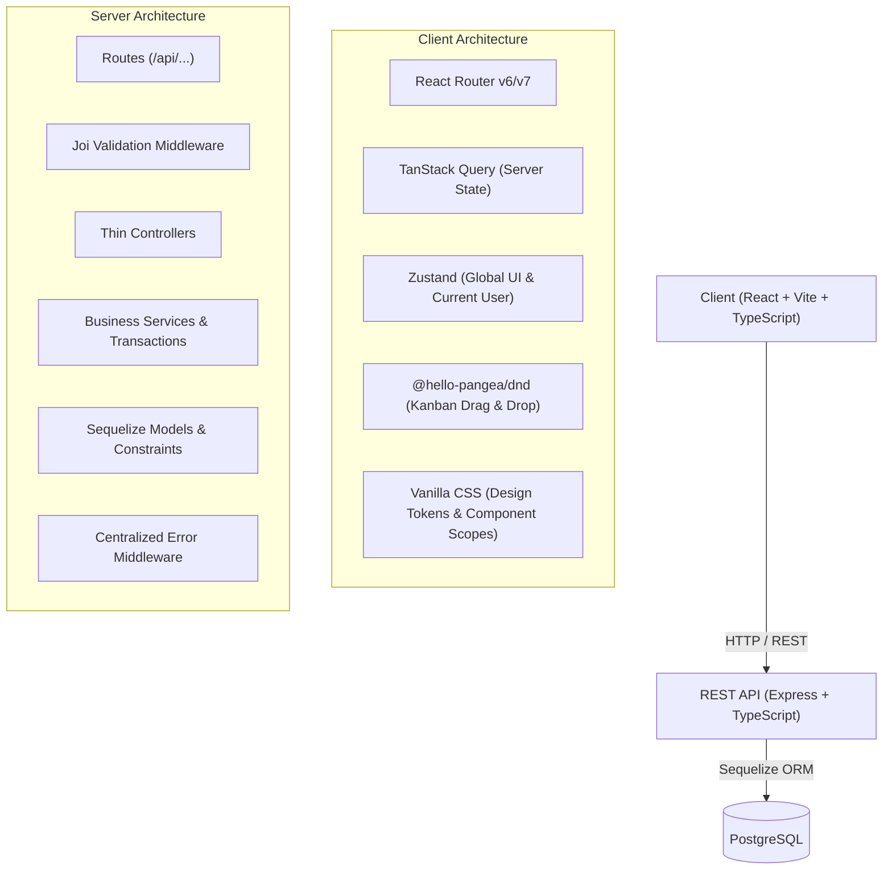

# Architecture Specification — Issue Tracker Demo

## 1. System Overview

The **Mini Jira/Trello Issue Tracker** is an enterprise-grade full-stack issue management system designed for speed, clarity, and rock-solid relational integrity.



---

## 2. Backend Layering & Separation of Concerns

The backend strictly adheres to a 4-tier layered architecture:

```
Request 
  │
  ▼
[Routes] ──▶ [Joi Validator] (rejects malformed requests early with 400)
  │
  ▼
[Controllers] (extracts params, query, body; delegates to Service)
  │
  ▼
[Services] (business rules, transactions, unique key generation, position math)
  │
  ▼
[Models & ORM] (Sequelize queries, foreign key enforcement, indexes)
  │
  ▼
Database (PostgreSQL)
```

### Centralized Response Helper
Every endpoint responds with the standard payload format:
```typescript
interface ApiResponse<T> {
  success: boolean;
  data?: T;
  message?: string;
  error?: {
    message: string;
    code?: string;
    details?: any;
  };
}
```

### Error Handling Architecture
Custom error class `AppError(message, statusCode, code, details)` extends standard `Error`.
Centralized error middleware:
- Catches known `AppError` and emits designated HTTP status codes.
- Catches Sequelize validation & unique constraint errors and returns clean 400/409 responses.
- Catches unhandled exceptions, logs them with stack trace, and returns 500 without leaking sensitive internals.

---

## 3. Frontend Architecture

### State Management Strategy
1. **Server State**: TanStack Query manages all data fetched from `/api/*`.
   - Optimistic updates are used during drag-and-drop: immediately reorders cards in the cache on drag end, then rolls back cleanly if the network request fails.
2. **Global Client State**: Zustand manages client-only concerns:
   - `useUserStore`: Currently active demo user (for comments and assignments).
   - `useUIStore`: Sidebar collapsed state, active modal states, board filter criteria.

### Styling System
- Clean, modern **Vanilla CSS**.
- Design tokens defined in CSS Custom Properties (`--bg-primary`, `--text-primary`, `--accent-indigo`, `--priority-urgent`, etc.).
- Modular BEM-style or feature-scoped CSS classes ensuring no global collisions.

---

## 4. Concurrency & Data Integrity Invariants

1. **Issue Key Uniqueness**: Issue keys (e.g. `WOLF-1`, `WOLF-2`) are derived from `project.key` and `issue_number`. `issue_number` is computed and stored inside a transaction to prevent race conditions.
2. **Stable Drag & Drop Ordering**: Issues within a column maintain a float `position`. Moving an issue sets `position = (prev.position + next.position) / 2`. If positions get too close, the service re-normalizes the column inside a database transaction.
3. **Membership Verification**: An issue can only be assigned to a user who is an active member of that project (`ProjectMember` association).
